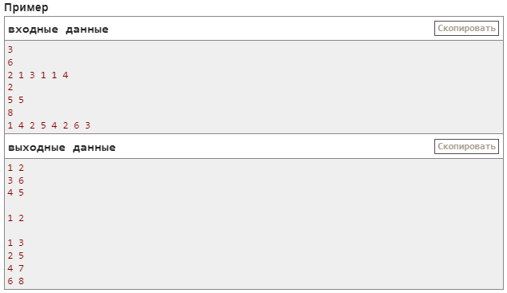

## B. Парное программирование (10 баллов)
- ограничение по времени на тест: 1.0 с
- ограничение по памяти на тест: 512 мегабайт
- ввод: стандартный ввод
- вывод: стандартный вывод

[download saved page](Screens/Task_B.mhtml)

### Задача
В компании работает n разработчиков, где n — четное число. Сумасшедший менеджер решил разбить всех разработчиков на команды по два человека.

Для этого он составил список всех разработчиков и назначил каждому из них номер по списку (от 1 до n) и значение ai — уровень мастерства i-го в списке разработчика.

### Описание
Очередную команду он составляет следующим образом:
- первый разработчик в команде тот, кто идет первым в списке;
- ему в пару подбирается такой, что разница их уровней минимальна (то есть минимально значение |aᵢ−aᵧ|, где |x| — это модуль числа x); если таких кандидатов несколько, то выбирается из них тот, кто находится раньше в списке;
- эти два разработчика образуют команду и удаляются из списка.

Например, если массив a равен [2,1,3,1,1,4], то формирование команд будет происходить следующим образом:
- назначим разработчикам номера [1,2,3,4,5,6] в соответствии с их положением в списке, первый среди них имеет номер 1, его уровень мастерства a₁=2, подходящими (с минимальной абсолютной разностью) являются разработчики с номерами 2,3,4,5, первый среди них 2, таким образом первая команда — это разработчики с номерами 1 и 2;
- оставшиеся разработчики теперь имеют номера [3,4,5,6], первый среди них 3, его уровень a₃=3, разработчик с минимальной абсолютной разностью только один (номер 6), таким образом команда — разработчики с номерами 3 и 6;
- оставшиеся разработчики имеют номера [4,5], первый среди них 4, его уровень a₄=1, остался только разработчик с номером 5, таким образом третья команда — разработчики с номерами 4 и 5.

Ваша задача — помочь сумасшедшему менеджеру промоделировать процесс разбиения на команды. Обратите внимание, что команды должны быть выведены в порядке, описанном выше в условии.

### Входные данные
Первая строка содержит одно целое число t
(1≤t≤50)
— количество наборов входных данных.

Первая строка каждого набора содержит одно целое число n
$$(2≤n≤50; n=четное)$$
— количество разработчиков.

Вторая строка содержит n целых чисел a₁, a₂, …, aₙ (1≤aᵢ≤100), где aᵢ — уровень мастерства i-го разработчика.

### Выходные данные
Для каждого набора входных данных выведите n/2 строк, i-я строка должна содержать пару чисел — номер первого и второго разработчика в i-й команде в порядке, описанном в условии.

Выводите пустую строку между выводами для наборов входных данных.

### Примечание
Первый набор входных данных из примера разобран в условии задачи.