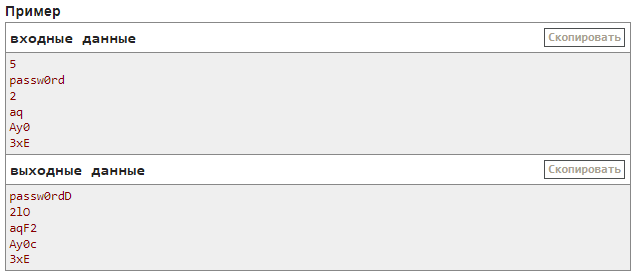

## D. Подсказчик паролей (10 баллов)
- ограничение по времени на тест: 1.0 с
- ограничение по памяти на тест: 512 мегабайт
- ввод: стандартный ввод
- вывод: стандартный вывод

[download saved page](Screens/Task_D.mhtml)

### Задача
Вам поручили реализовать модуль, который помогает пользователю придумать надежный пароль.

Пароль называется надежным, если он состоит только из букв латинского алфавита, а также цифр, и содержит в себе:
- хотя бы одну прописную букву (букву в верхнем регистре);
- хотя бы одну строчную букву (букву в нижнем регистре);
- хотя бы одну гласную букву;
- хотя бы одну согласную букву;
- хотя бы одну цифру.

### Описание
Гласными буквами в этой задаче будем считать следующие буквы латинского алфавита: **e**, **u**, **i**, **o**, **a**, **y** (а также их аналоги в верхнем регистре). Остальные же буквы считаются согласными. Заметьте, что буква **y** является только гласной.

Вам задан список пользователей, отправивших свои пароли на сервер. Для каждого пароля вам необходимо дополнить его минимальным количеством символов справа таким образом, чтобы он считался надежным. Если существует несколько способов дополнить пароль минимальным количеством символов, вам разрешается вывести любой из них.

Обратите внимание, что если пароль уже является надежным, то его не нужно дополнять.

### Входные данные
В первой строке входных данных задано одно целое число t
$$(1≤t≤500)$$
— количество пользователей, отправивших пароли на сервер.

Далее следуют описания паролей пользователей. Единственная строка описания пароля содержит строку s длины от 1 до 20. Строка содержит только цифры и/или строчные/прописные буквы латинского алфавита.

### Выходные данные
Для каждого пользователя выведите в новой строке предлагаемый ему пароль. Заметьте, что выведенный пароль должен быть дополнен справа минимальным количеством символов таким образом, чтобы он считался надежным. Если существует несколько способов дополнить пароль минимальным количеством символов, вам разрешается вывести любой из них. Пароли выводите в порядке их поступления во входных данных.

