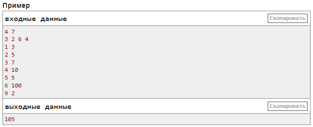

## I. Планировщик задач (30 баллов)
- ограничение по времени на тест: 5.0 с
- ограничение по памяти на тест: 256 мегабайт
- ввод: стандартный ввод
- вывод: стандартный вывод

[download saved page](Screens/Task_I.mhtml)

### Задача
Представьте, вы собрали собственный сервер из n разнородных процессоров и теперь решили создать для него простейший планировщик задач.

Ваш сервер состоит из n процессоров. Но так как процессоры разные, то и достигают они одинаковой скорости работы при разном энергопотреблении. А именно, i-й процессор в нагрузке тратит aᵢ энергии за одну секунду.

Вашему серверу в качестве тестовой нагрузки придет m задач. Про каждую задачу вам известны два значения: tᵧ и lᵧ — момент времени, когда задача y придет и время выполнения задачи в секундах.

Для начала вы решили реализовать простейший планировщик, ведущий себя следующим образом: в момент tᵧ прихода задачи, вы выбираете свободный процессор с минимальным энергопотреблением и выполняете данную задачу на выбранном процессоре все заданное время. Если к моменту прихода задачи свободных процессоров нет, то вы просто отбрасываете задачу.

Процессор, на котором запущена задача y будет занят ровно lᵧ секунд, то есть освободится ровно в момент tᵧ+lᵧ и в этот же момент уже может быть назначен для выполнения какой-то другой задачи.

Определите суммарное энергопотребление вашего сервера при обработке m заданных задач (будем считать, что процессоры в простое не потребляют энергию).

Неполные решения этой задачи (например, недостаточно эффективные) могут быть оценены частичным баллом.

### Входные данные
В первой строке заданы два целых числа n и m
$$(1≤n,m≤3⋅10^5)$$
— количество процессоров и задач соответственно.

Во второй строке заданы n целых чисел a₁, a₂, …, aₙ
$$(1≤aᵢ≤10^6)$$
— энергопотребление соответствующих процессоров под нагрузкой в секунду. Все энергопотребления различны.

В следующих m строках заданы описания задач: по одному в строке. В y-й строке заданы два целых числа tᵧ и lᵧ
$$(1≤tᵧ≤10^9; 1≤lᵧ≤10^6)$$
— момент прихода y-й задачи и время ее выполнения.

Все времена прихода tᵧ различны, и задачи заданы в порядке времени прихода.

### Выходные данные
Выведите единственное число — суммарное энергопотребление сервера, если потреблением энергии в простое можно пренебречь.

### Примечание
Рассмотрим работу планировщика по секундно:
- t=1: приходит первая задача, все процессоры свободны. Задача занимает второй процессор на 3 секунды.
- t=2: приходит вторая задача. Второй процессор занят, а потому задача занимает первый процессор на 5 секунд.
- t=3: приходит третья задача и занимает четвертый процессор на 7 секунд.
- t=4: приходит четвертая задача. Второй процессор освободился в данный момент, а потому его и занимает задача на 10 секунд.
- t=5: приходит пятая задача и занимает последний свободный на данный момент процессор (третий) на 5 секунд.
- t=6: приходит шестая задача. Все процессоры еще заняты, а потому задача отбрасывается.
- t=7: освобождается первый процессор.
- t=9: приходит седьмая задача и занимает первый процессор на 2 секунды.
- t=10: освобождаются третий и четвертый процессоры.
- t=11: освобождается первый процессор.
- t=14: освобождается второй процессор.

Общее энергопотребление равно
$$3⋅2 + 5⋅3 + 7⋅4 + 10⋅2 + 5⋅6 + 2⋅3 = 6+15+28+20+30+6 = 105$$